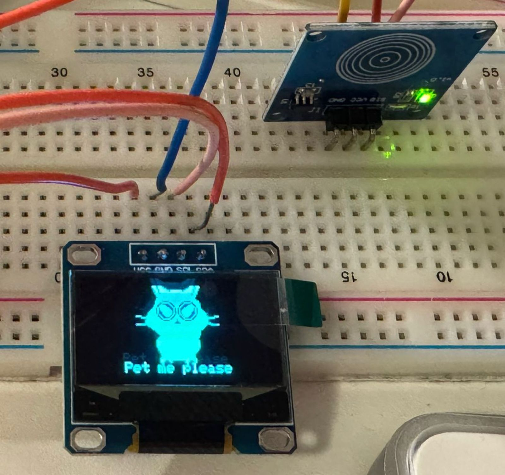

# 🐱 Suzume Cat — Interactive OLED Pet

An interactive manga-style cat animation on a 128×64 OLED display, controlled by a touch sensor. The cat reacts when you pet it, stays happy for a few seconds after, and gets angry if you ignore it for too long.

&gt; Inspired by the cat from **Suzume no Tojimari** (すずめの戸締まり).

---

## 📸 Preview

| State | Behavior | Screen |
|-------|----------|--------|
| **Waiting** | Sits and blinks, tail gently sways | `Pet me please` |
| **Petting** | Jumps up and down, fast tail wag | `Happy... &lt;3` |
| **Afterglow** | Keeps jumping 3 more seconds after release | `Yay! :3` |
| **Angry** | Ears flat, tail down, frown | `I'm angry!` |

---

## 🛠 Hardware Requirements

| Component | Specs | Qty |
|-----------|-------|-----|
| Arduino Nano | ATmega328P, 5V / 3.3V logic | 1 |
| OLED Display | 128×64, I2C, SSD1306 driver | 1 |
| Touch Sensor | TTP223 capacitive touch module | 1 |
| Jumper Wires | Male-to-female or male-to-male | 8+ |

---

## 🔌 Wiring Diagram

### OLED Display (I2C)

| OLED Pin | Arduino Nano Pin | Note |
|----------|------------------|------|
| **VCC** | **3.3V** | Power |
| **GND** | **GND** | Ground |
| **SCL** | **A5** | I2C Clock (fixed) |
| **SDA** | **A4** | I2C Data (fixed) |

&gt; No external resistors needed — the OLED module has built-in pull-ups.

### Touch Sensor (TTP223)

| Sensor Pin | Arduino Nano Pin | Note |
|------------|------------------|------|
| **VCC** | **5V** | Power |
| **GND** | **GND** | Ground |
| **SIG** | **D2** | Touch signal input |

&gt; The TTP223 outputs **HIGH** when touched, **LOW** when released.

---

## 💻 Software Requirements

- **Arduino IDE** 1.8.x or 2.x
- **Adafruit SSD1306** library
- **Adafruit GFX** library

### Install Libraries

1. Open **Arduino IDE**
2. Go to **Sketch → Include Library → Manage Libraries…**
3. Search and install:
   - `Adafruit SSD1306` by Adafruit
   - `Adafruit GFX Library` by Adafruit
4. Restart Arduino IDE

---

## 🚀 Installation & Upload

1. **Wire** the components according to the table above.
2. **Connect** the Arduino Nano to your computer via USB.
3. In Arduino IDE, select:
   - **Board:** `Arduino Nano`
   - **Processor:** `ATmega328P` (or `ATmega328P (Old Bootloader)` if upload fails)
   - **Port:** Your Nano's COM port
4. **Copy** the sketch code into a new `.ino` file.
5. Click **Upload** (→).

The cat should appear on the OLED immediately.

---

## 🎮 How to Play

| Action | What Happens |
|--------|--------------|
| **Touch the sensor** | Cat jumps happily, tail wags fast, message shows `Purr... &lt;3` |
| **Hold your finger** | Cat keeps bouncing in the center |
| **Release finger** | Cat continues jumping for **3 seconds** (`Yay! :3`), then goes back to waiting |
| **Ignore for 10 min** | Cat sits low with flat ears and angry face (`I'm angry!`) |
| **Touch when angry** | Instantly resets to happy jumping! |

---

## ⚙️ Configuration

You can tweak the timing in the code:

    #define ANGRY_TIMEOUT 600000UL  // Time before angry (ms) -&gt; 10 minutes
    #define AFTERGLOW_MS  3000UL    // Happy time after release (ms) -&gt; 3 seconds

| Constant        | Default | Description                                      |
|-----------------|---------|--------------------------------------------------|
| ANGRY_TIMEOUT   | 600000  | Milliseconds before cat gets angry (10 min)      |
| AFTERGLOW_MS    | 3000    | Milliseconds cat stays happy after you let go (3 sec) |
| TOUCH_PIN       | 2       | Digital pin for touch sensor                     |

---

## 🐛 Troubleshooting

| Problem            | Cause           | Fix                                                    |
|--------------------|-----------------|--------------------------------------------------------|
| Screen stays black   | Wrong I2C address | Change SCREEN_ADDRESS to 0x3D                          |
| Upload fails         | Old bootloader  | Try ATmega328P (Old Bootloader) in Tools             |
| Touch not responding | Wrong pin       | Check SIG is wired to D2                               |
| Touch too sensitive  | Sensor mode     | Add a small capacitor between SIG and GND, or cover the pad with tape |
| Cat looks glitchy    | Low power       | Make sure Nano VCC is stable; OLED draws ~20 mA        |

### Find your OLED I2C address

Upload this scanner if you are unsure:

    #include &lt;Wire.h&gt;
    void setup() {
      Wire.begin(); Serial.begin(9600);
      for (byte a = 1; a &lt; 127; a++) {
        Wire.beginTransmission(a);
        if (!Wire.endTransmission()) {
          Serial.print("Found: 0x"); Serial.println(a, HEX);
        }
      }
    }
    void loop() {}

Open Serial Monitor (9600 baud) to see the address.

---

## 📁 File Structure

    suzume-cat-oled/
    ├── suzume-cat-oled.ino   &lt;- Main sketch
    ├── README.md             &lt;- This file
    └── docs/
        └── wiring.png        &lt;- (Optional) photo of your build

---

## 📝 Credits

- Cat design inspired by Daijin from Suzume no Tojimari (Makoto Shinkai, 2022)
- Graphics library by Adafruit Industries (https://www.adafruit.com/)
- Built for Arduino Nano + SSD1306 OLED

---

## 📜 License

This project is released for personal and educational use.
Feel free to modify, share, and build upon it. 🐾
